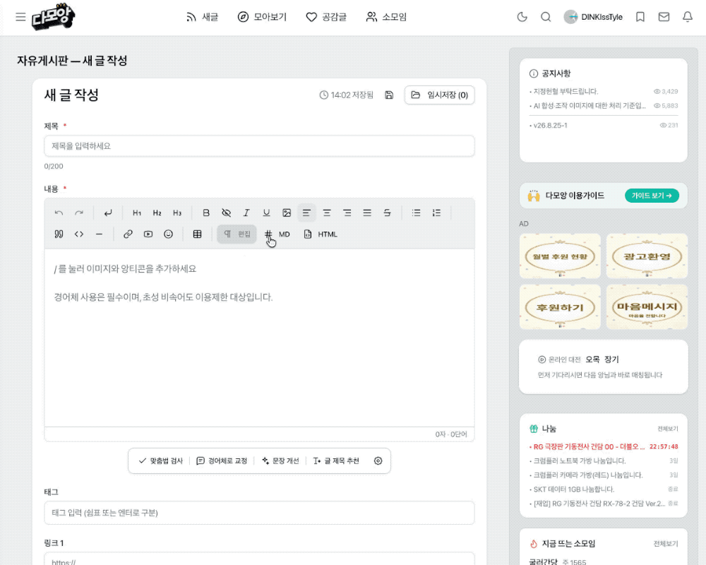

# AIAng

`damoang.net`의 제목, 본문, 댓글 입력기에 AI 교정 도구를 추가하는 Chrome 확장 프로그램입니다.

<div align="center"></div>

## 기능

- 글 작성·수정 툴바의 맞춤법 검사로 제목과 본문을 함께 검토하고 한 번에 반영
- 본문 아래의 `맞춤법 검사`, `경어체로 교정`, `문장 개선`, `글 제목 추천`
- 댓글 아래의 `맞춤법 검사`, `경어체로 교정`, `문장 개선`, `글 꾸미기`
- 처리 중인 작업 버튼의 `×`를 누르거나 같은 버튼을 다시 눌러 진행 중인 AI 요청 취소
- 본문을 바탕으로 200자 이하의 제목 5개를 추천하고 선택한 제목을 제목란에 입력
- 게시물 보기 화면의 작성자 정보와 본문 사이에서 제목·본문의 Markdown 구조만 추출해 AI 요약 결과를 Markdown 모달로 표시
- 게시물과 댓글 내용을 함께 분석해 공통 반응·의견 차이·질문·우려·전반적인 분위기를 Markdown으로 요약
- 제목 추천을 제외한 교정 결과를 편집기 위에 인라인으로 표시하고 항목별 또는 전체 적용
- 맞춤법·경어체·문장 개선·글 꾸미기의 변경 위치, 교정안 팝오버와 세부 사유 표시
- OpenAI 호환 API/LM Studio와 Chrome 내장 Gemini Nano 지원
- Temperature 자동 설정 시 OpenAI 호환 요청에서 온도 값을 생략해 서버·모델 기본값 사용
- 모든 교정 프롬프트에 적용되는 개인화 사용자 지침
- 다모앙의 글 작성(`/write`)·수정(`/edit`) 화면, SPA 화면 갱신과 `textarea`/Tiptap 댓글 입력기 지원
- 다모앙의 라이트·다크·AMOLED 색상, 호버 하이라이트, 포커스 링, 라운드 값 자동 반영
- 본문 속 이미지·미디어를 보호 토큰으로 유지하고 교정문 삽입 시 원래 DOM과 상대 위치 복원

## 설치

1. Chrome에서 `chrome://extensions`를 엽니다.
2. 오른쪽 위의 **개발자 모드**를 켭니다.
3. **압축해제된 확장 프로그램을 로드합니다**를 누르고 이 `AIAng` 폴더를 선택합니다.
4. 확장 프로그램 아이콘을 눌러 AI 연결을 설정합니다.

## LM Studio 예시

- API 기본 주소: `http://localhost:1234/v1`
- API 키: 비워 둠
- 모델: **모델 불러오기**를 눌러 현재 로드한 모델을 선택

LM Studio에서 Local Server를 먼저 실행해야 합니다.

## 참고

- API 키는 동기화하지 않고 `chrome.storage.local`에 저장합니다.
- 공개 OpenAI API 같은 장기 비밀 키는 브라우저 확장에 직접 저장하지 말고 개인 프록시나 단기 토큰을 사용하는 편이 안전합니다.
- 원격 OpenAI 호환 서버를 쓰면 해당 서버 도메인 권한을 저장/테스트 시 요청합니다.
- OpenAI 호환 요청에는 최대 출력 토큰 값을 보내지 않으며, 출력 길이는 LLM 서버의 기본 설정에 맡깁니다.
- Temperature의 **자동**을 선택하면 요청에 `temperature` 항목을 보내지 않고 서버·모델의 기본 설정에 맡깁니다.
- 이미지·미디어 보호 토큰이 AI 응답에서 누락되거나 변형되면 결과 적용을 자동으로 차단합니다.
- 확장 설정 화면은 운영체제의 라이트·다크 모드에 맞춰 같은 다모앙 디자인 토큰을 사용합니다.
- Gemini Nano의 사용 가능 여부와 모델 다운로드는 Chrome 및 기기 환경에 따라 다릅니다. 한국어 교정에는 Chrome의 다국어 Prompt API 지원이 필요합니다.

## 개발 검증

```bash
node --test tests/background-core.test.cjs
node --check background.js
node --check content.js
node --check options.js
```
